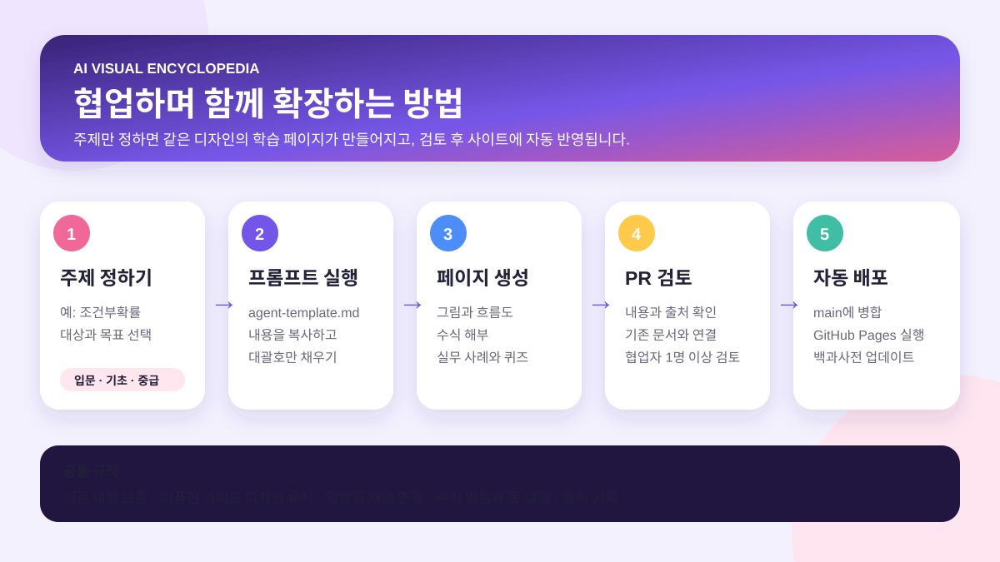

# AI Study — 시각 백과사전

그림·비유·수식 해부·실무 사례로 AI 개념을 연결하는 공동 학습 저장소입니다.

## 가장 쉬운 사용 방법

### 1. 공통 프롬프트 열기

[`prompts/agent-template.md`](prompts/agent-template.md)를 열고 프롬프트 전체를 복사합니다.

### 2. 대괄호만 채우기

아래처럼 주제와 원하는 수준을 입력합니다.

~~~text
이 저장소의 prompts/agent-template.md 지침대로 새 항목을 만들어줘.

주제: 조건부확률
대상: 완전 입문자
목표: p(A|B)를 읽고 디퓨전 역과정과 연결할 수 있기
난이도: 기초
선수지식: 자동 판단
기존 연결 항목: diffusion-prerequisites
강조: 그림과 직관, 수식 해부, 실무 사례
~~~

무엇을 선수지식으로 넣어야 할지 모르겠다면 `자동 판단`이라고 적으면 됩니다.

### 3. 에이전트에 저장소와 함께 전달하기

GitHub 저장소를 연결한 AI 에이전트에게 위 프롬프트를 전달합니다.
에이전트는 다음 파일을 읽고 같은 형식의 페이지를 만듭니다.

- [`AGENTS.md`](AGENTS.md): 모든 에이전트가 지켜야 하는 공통 규칙
- [`topics/diffusion-prerequisites.html`](topics/diffusion-prerequisites.html): 디자인과 설명 품질의 기준
- [`topics/_template.html`](topics/_template.html): 새 항목을 만드는 완성형 HTML 틀
- [`CONTRIBUTING.md`](CONTRIBUTING.md): 브랜치와 Pull Request 협업 규칙

### 4. 생성 결과 확인하기

에이전트가 새 브랜치와 Pull Request를 만들면 다음 항목을 확인합니다.

- 그림이나 흐름도만 봐도 전체 관계가 이해되는가?
- 수식 기호마다 읽는 법과 뜻이 있는가?
- 실제 AI 사례가 개념과 연결되어 있는가?
- 선수지식과 다음 학습 링크가 연결되어 있는가?
- 출처와 확인일이 적혀 있는가?
- 전문용어 옆 `i` 아이콘을 누르면 IPA·한글 발음·뜻·직관·미니 흐름이 본문에서 펼쳐지는가?

### 5. 검토 후 병합하기

협업자 중 한 명 이상이 내용을 확인한 뒤 Pull Request를 `main`에 병합합니다.
GitHub Pages가 활성화되어 있으면 병합된 내용이 백과사전 사이트에 자동 반영됩니다.

## 현재 항목

- [디퓨전 선수지식 전체](topics/diffusion-prerequisites.html)
- [대학교 학기별 학습 공간](university/index.html)
  - [해석학](university/analysis/index.html)
    - [2026년 9월 7일 — 집합·증명·완비성](university/analysis/2026-09-07.html)
    - [2026년 9월 8일 — 상한의 증명·완비성·엡실론 판별법](university/analysis/2026-09-08.html)
  - [데이터사이언스를 위한 베이지안추론](university/bayesian-inference-for-data-science/index.html)
    - [2026년 9월 8일 — 충분통계량·가능도 원리·베이즈 가설검정](university/bayesian-inference-for-data-science/2026-09-08.html)
- [딥러닝의 기초 및 응용](university/deep-learning-foundations-applications/index.html)
  - [2026년 9월 7일 — 이미지 분류의 관점과 선형 분류기](university/deep-learning-foundations-applications/2026-09-07.html)
- [대학원 학기별 학습 공간](graduate/index.html)
  - 2026년 2학기
  - 트랜스포머와 거대언어모델
  - 디퓨전과 거대비전모델
  - 산업 AI의 기초

## IT 카테고리를 수정하는 방법

메인의 6개 IT 카테고리 카드와 각 카테고리의 학습 항목은  
[data/knowledge-categories.json](data/knowledge-categories.json)에서 통합 관리합니다.

- categories 배열에 객체를 추가하면 메인 카드가 자동 생성됩니다.
- 해당 객체의 topics 배열에 학습 항목을 추가하면 카테고리 페이지에 자동 표시됩니다.
- title, icon, color, description을 바꾸면 메인과 카테고리 화면에 함께 반영됩니다.
- 새 카테고리는 categories 폴더의 기존 HTML 하나를 복사한 뒤 body의 data-category 값만 새 id로 바꾸면 됩니다.

~~~json
{
  "id": "new-topic",
  "title": "새 학습 항목",
  "tag": "입문",
  "description": "학습 항목 소개",
  "path": "선수지식 → 현재 개념 → 다음 학습",
  "href": "topics/new-topic.html",
  "status": "학습 시작"
}
~~~

## 대학원 과목을 수정하는 방법

대학원 화면은 HTML을 직접 수정하지 않아도 됩니다.  
[data/graduate-curriculum.json](data/graduate-curriculum.json)에서 학기와 과목 정보만 추가하거나 수정하세요.

과목의 href에는 연결할 학습 페이지 경로를 입력합니다. 아직 페이지가 없다면 null로 두면 **자료 준비 중** 상태로 표시됩니다.

~~~json
{
  "id": "new-course",
  "title": "새 과목명",
  "icon": "📘",
  "color": "#7357e8",
  "description": "과목 소개",
  "href": "../topics/new-course.html",
  "status": "학습 시작"
}
~~~

새 학기는 semesters 배열에 기존 학기 객체를 복사해서 추가하면 자동으로 새 탭이 생성됩니다.

### 과목의 수업 일정과 강의 자료 매핑

각 과목 화면(`graduate/<course>/index.html`)은 `data/<course>-course.json` 하나로 두 영역을 그립니다.

- `weeks`: 시각 학습 자료 카드. **Stanford Lecture 단위**(week1.html = Lecture 1)이며 `slides`에 강의 PDF, `classWeeks`에 그 자료를 다루는 실제 수업 주차를 적습니다.
- `syllabus`: **실제 수업 주차 단위**(16주) 일정표. `lecture` 값으로 `weeks`의 카드와 연결되고, `href`는 해당 카드의 페이지를 가리킵니다.

~~~json
{
  "week": 3,
  "date": "2026-09-19",
  "topic": "Transformer-based models & tricks",
  "type": "lecture",
  "lecture": 2,
  "slides": "https://cme295.stanford.edu/slides/fall25-cme295-lecture2.pdf",
  "href": "week2.html"
}
~~~

`type`은 `lecture`(강의) · `recorded`(녹강) · `holiday`(휴강) · `exam`(시험) · `review`(해설강의) 중 하나이며, 시험·휴강처럼 자료가 없는 주차는 `lecture`, `slides`, `href`를 `null`로 둡니다.
일정표는 오늘 날짜 기준으로 지난 수업은 흐리게, 다음 수업은 강조해서 표시합니다.

## 폴더 안내

~~~text
AI_Study/
├── AGENTS.md                         # 에이전트 공통 규칙
├── CONTRIBUTING.md                   # 사람의 협업 규칙
├── index.html                        # 백과사전 첫 화면
├── .github/
│   ├── pull_request_template.md      # PR 체크리스트
│   └── workflows/pages.yml           # GitHub Pages 배포
├── assets/
│   ├── how-to-use-v2.svg             # 사용방법 이미지
│   ├── inline-terms.css / .js        # 본문 용어 `i` 아이콘 공통 자산
│   ├── category-page.css / .js       # IT 카테고리 화면 공통 렌더러
│   └── course-syllabus.css / .js     # 대학원 과목 화면 공통 렌더러 (수업 일정표 + 강의 카드)
├── data/
│   ├── knowledge-categories.json     # IT 카테고리·학습 항목 데이터
│   ├── graduate-curriculum.json      # 대학원 학기·과목 데이터
│   ├── transformer-llm-course.json   # 과목별 강의 자료(weeks) + 16주 수업 일정(syllabus)
│   ├── diffusion-lvm-course.json
│   ├── industrial-ai-course.json
│   └── university-curriculum.json    # 대학교 학기·과목 데이터
├── graduate/
│   ├── index.html                    # 반응형 대학원 과목 화면
│   ├── transformer-llm/              # index.html + week0~7.html (Stanford Lecture 단위 시각 자료)
│   ├── diffusion-lvm/                # index.html + week0~7.html
│   └── industrial-ai/                # index.html + week0~1.html + ai-history-map.html
├── university/
│   ├── index.html
│   └── analysis/                     # 해석학 — 날짜별 학습 문서
├── categories/                       # IT 지식 카테고리 화면
├── prompts/
│   ├── agent-template.md             # 공통 에이전트 프롬프트
│   └── create-topic.md               # 간단한 주제 생성 프롬프트
└── topics/
    ├── _template.html                # 새 문서용 시각 HTML 템플릿
    └── diffusion-prerequisites.html  # 기준 디자인 문서
~~~

## 협업 흐름

1. 저장소를 clone 또는 fork합니다.
2. `topic/<주제명>` 브랜치를 만듭니다.
3. [`AGENTS.md`](AGENTS.md)의 공통 규칙을 에이전트가 먼저 읽게 합니다.
4. [`prompts/agent-template.md`](prompts/agent-template.md)를 복사해 주제만 채웁니다.
5. [`topics/_template.html`](topics/_template.html)을 기반으로 새 항목을 작성합니다.
6. Pull Request를 열고 다른 구성원의 검토를 받습니다.
7. `main`에 병합되면 GitHub Pages가 자동 배포합니다.

## 문서 원칙

- 기존 내용을 임의로 삭제하거나 축약하지 않습니다.
- 글보다 관계도·흐름도·비교표·수식 해부를 우선합니다.
- 선수지식, 다음 학습, 관련 항목을 양방향으로 연결합니다.
- 수식은 기호의 발음·뜻·역할·문장으로 읽기를 포함합니다.
- 사실과 수치에는 출처와 확인일을 남깁니다.

에이전트 공통 규칙은 [AGENTS.md](AGENTS.md), 사람의 협업 규칙은 [CONTRIBUTING.md](CONTRIBUTING.md)를 확인하세요.
